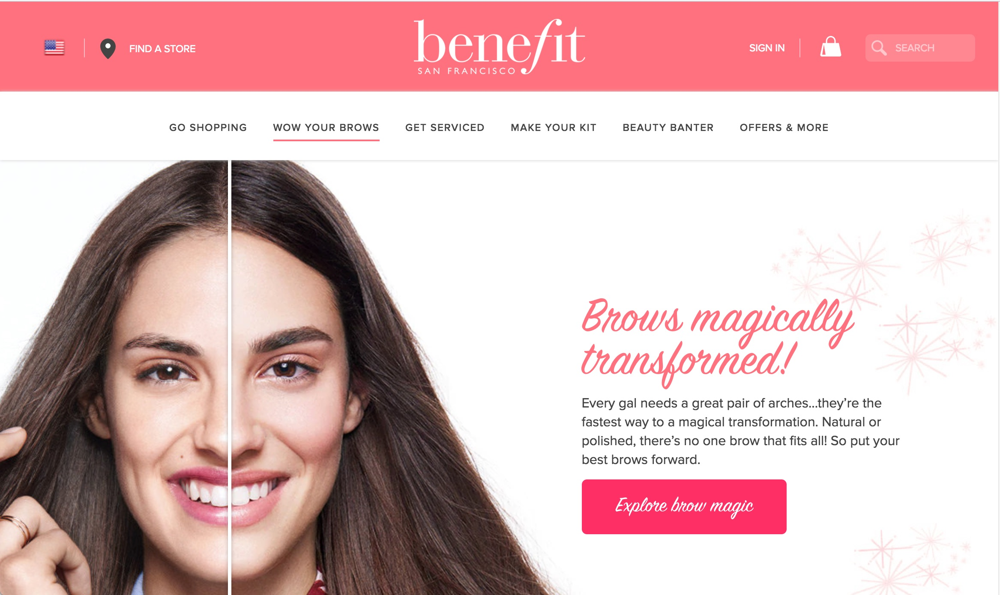
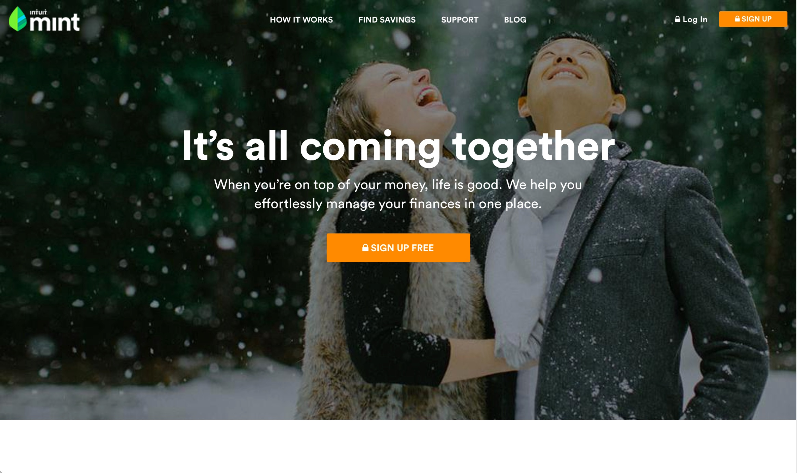
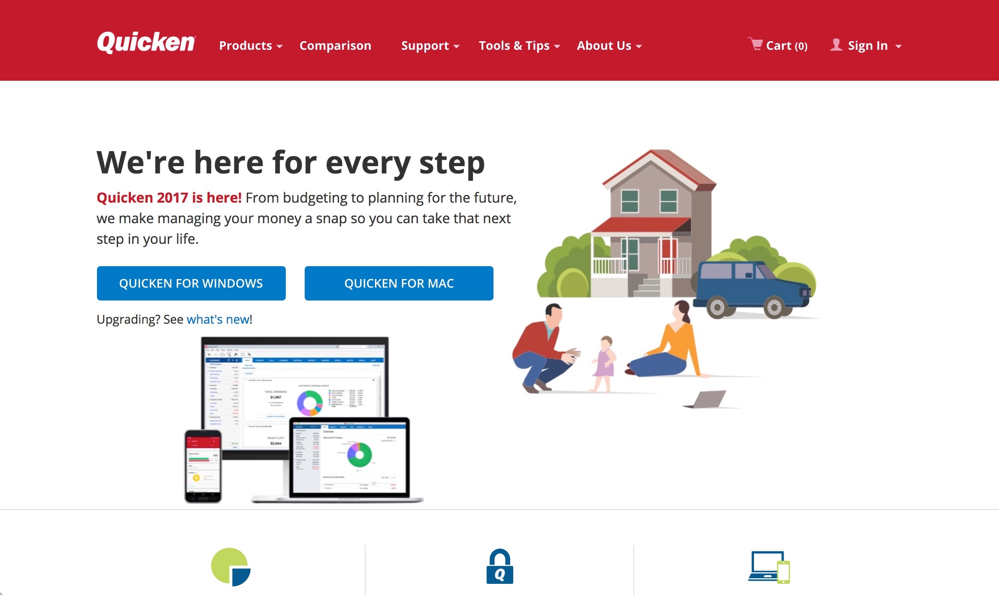
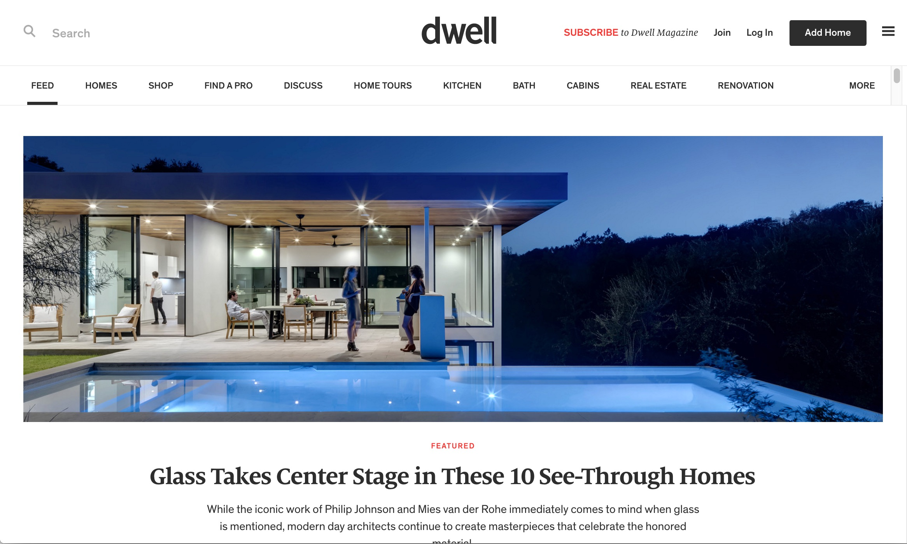

Senior Software Engineer at Compass. Previously at Glossier.

I write, think, and talk about web development. I bring expertise in
front-end technology, UI design, and test driven development.

I current live in New York City and work as a tech lead at Compass. I work
primarily on the Content Management System for Compass's real estate agents.
Previously, I worked as a front-end lead developer for Glossier.

<section id="recent-work" class="buffer container-fluid max-width">
  <h2 class="section-title">Past Projects</h2>
    

      

        

          
          

            
          

        

      

      

        

          
          

            
          

        

      

    

    

      

        

          
          

            
          

        

      

      

        

          
          

            
          

        

      

    

</section>

<section id="contact">
  

    <h2 class="section-title">Get in touch</h2>
    <ul class="list">
    
      <li>
        {{contact.title}}: <a href="{{contact.link}}" target="_blank">{{contact.username}}</a>
      </li>
    
    </ul>
  

</section>

